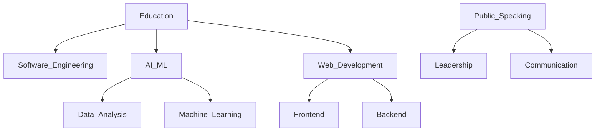

# 
✨ Senuji De Silva ✨

  
  %20Student%20|%20Web%20Developer%20|%20AI%20Enthusiast&descAlignY=60&descAlign=50)

  

    
    
    
    
  

## 
💫 About Me

  

- 🎓 Currently pursuing **BEng (Hons) in Software Engineering** at the University of Westminster
- 💻 Part-time Web Designer, Developer, and Software Engineer
- 🤖 Passionate about AI, Deep Learning, and Machine Learning
- 🌐 Expert in creating responsive, user-friendly websites and applications
- 🎤 Dedicated member of Toastmasters International and former Vice President of Public Relations
- 🚀 Always exploring new technologies and refining my skills

 

## 
🛠️ Technologies & Tools

  
  
  
  
  
  
  
  
  
  
  
  
  
  
  
  
  
  
  

## 
📊 GitHub Stats

  

  
  

  

  

## 
🔥 My Journey

  

## 
✨ Let's Connect!

  
I'm always open to collaborating on exciting projects and exploring new opportunities. Feel free to reach out if you'd like to discuss ideas or just want to connect!

  
  

